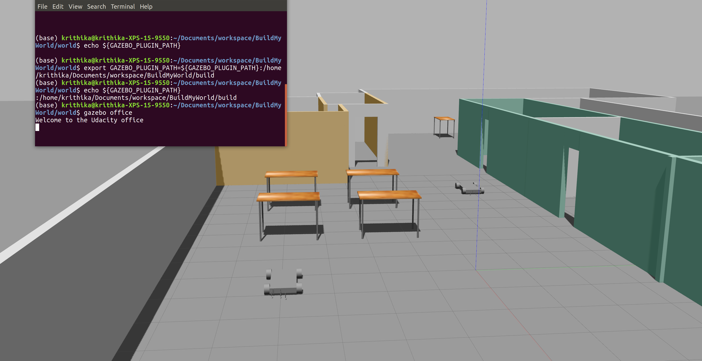

[![Udacity - Robotics NanoDegree Program]

# Build My World
The purpose of this lab is to learn how to build an environment that can house the two-wheeled robot model with the Model Editor tool in Gazebo. This world consists of the two-wheeled model and the custom building. A plugin is also included to interact with this world.  

### Directory Structure
```
    .BuildMyWorld                    # Build My World Project 
    ├── model                          # Model files 
    │   ├── Building
    │   │   ├── model.config
    │   │   ├── model.sdf
    │   ├── HumanoidRobot
    │   │   ├── model.config
    │   │   ├── model.sdf
    ├── script                         # Gazebo World plugin C++ script      
    │   ├── welcome_message.cpp
    ├── world                          # Gazebo main World containing models 
    │   ├── UdacityOffice.world
    ├── CMakeLists.txt                 # Link libraries 
    └──                              
```

### Steps to launch the simulation

#### Step 1 Update and upgrade the Workspace image
```sh
$ sudo apt-get update
$ sudo apt-get upgrade -y
```
#### Step 2 Compile the code
```sh
$ cd /home/workspace/BuildMyWorld/
$ mkdir build
$ cd build/
$ cmake ../
$ make
```

#### Step 3 Add the library path to the Gazebo plugin path  
```sh
$ export GAZEBO_PLUGIN_PATH=${GAZEBO_PLUGIN_PATH}:/home/workspace/BuildMyWorld/build
```

#### Step 4 Run the Gazebo World file  
```sh
$ cd /home/workspace/BuildMyWorld/world/
$ gazebo office
```

### Output
The hello world message and the two-wheeled robot inside a Gazebo World should both launch as follow: 



    
 
